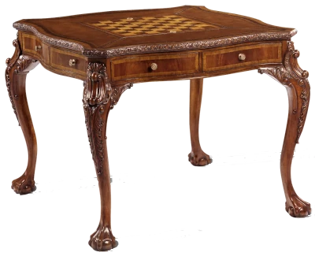
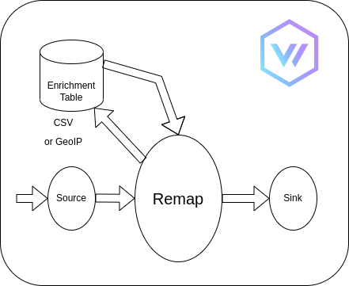

<!--
theme: gaia
_class: lead invert
-->

# Enrichment Tables




-----


# What is an Enrichment Table?

----



* <table>
    <tr><th>ID</th><th>NAME</th></tr>
    <tr><td>1</td><td>John</td></tr>
    <tr><td>2</td><td>Sue </td></tr>
  </table>
* ```
  {"id": 2, 
   "message": "happy birthday"}
  ```
* ```
  {"id": 2, 
   "name": "Sue", 
   "message": "happy birthday"}
  ```

----

# Vector config

```yaml
enrichment_tables:
  file:
    type: file
    file:
      path: "../data.csv"
      encoding:
        type: csv
        delimiter: ','
        include_headers: true
    schema:
      id: integer
      
transforms:
  remap:
    type: remap
    inputs: 
      - stdin
    source: |
      enriched, err = get_enrichment_table_record("file", {"id": .id})
      if is_null(err) {
        .name = enriched.name
      } else {
        log(err, level:"error")
      }
      
      
      
````

---


# Requirements for enrichment tables

* Performance

---

# Indexes

- Criteria in enrichment tables are AND only.

--- 

On load:

* Remap function informs the enrichment table the fields it searches on.
* For each row in the data:
* Build up a string containing each column in the index.
* Hash the resulting string using `seahash`:
  > *SeaHash*: A blazingly fast, portable hash function with proven statistical guarantees.
* Store hashed value in a *hash -> position* `HashMap`.

--- 

On query:

```coffee
  enriched, err = get_enrichment_table_record("file", 
                                              {"first_name": .first_name,
                                               "surname": .surname
                                              })
```

* Build up a string containing the value of each column in the search criteria.
* Hash this string using `seahash`.
* Lookup this value in the index. If it is there, fetch the values at the 
  returned position from the data.
* Sequential scan over the returned results to get the final results.

---

# The exception

- Date range search

```coffee
  enriched, err = get_enrichment_table_record("file", 
                                              {"city": .city,
                                               "dob": {
                                                  "from": .start,
                                                  "to": .end
                                                }
                                              })
```

---

Dates can't be indexed so can only be included as part of the sequential scan.


<div style="text-align: center;"> 


This can kill performance.
</div>

---

# No locking

Multiple threads can access the enrichment tables at any time.

## ArcSwap

* Writes using atomics swaps. 
* Reads are performed lock free.

--- 

```rust
type TableMap = HashMap<String, Box<dyn Table + Send + Sync>>;

#[derive(Clone, Default)]
pub struct TableRegistry {
    loading: Arc<Mutex<Option<TableMap>>>,
    tables: Arc<ArcSwap<Option<TableMap>>>,
}
```


- Load data into `loading`.
- Swap it into `tables`.

```rust
    pub fn finish_load(&self) {
        let mut tables_lock = self.loading.lock().unwrap();
        let tables = tables_lock.take();
        self.tables.swap(Arc::new(tables));
    }
```

---

# Reloading

```rust
pub struct TableRegistry {
    loading: Arc<Mutex<Option<TableMap>>>,
    tables: Arc<ArcSwap<Option<TableMap>>>,
}
```

* For each table in the config, if that table needs reloading:
  Load this table from the file.
* For all other tables:
  Clone that table from `tables`.
* Set `loading` to this list.
* Swap `loading` into `tables`.

---

# Where is the source?

- `src/enrichment_tables/`
- `lib/enrichment/`

---

# Questions?
